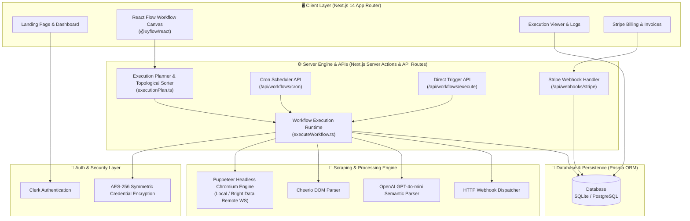
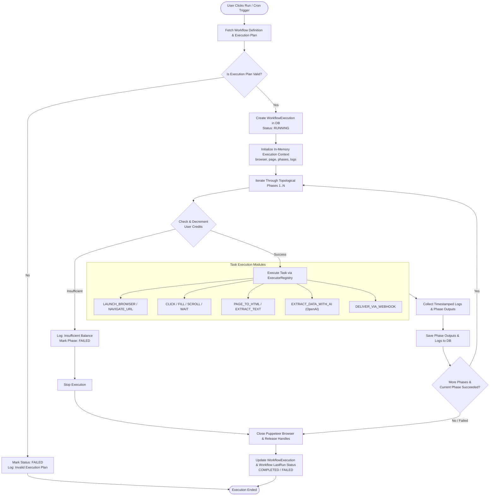
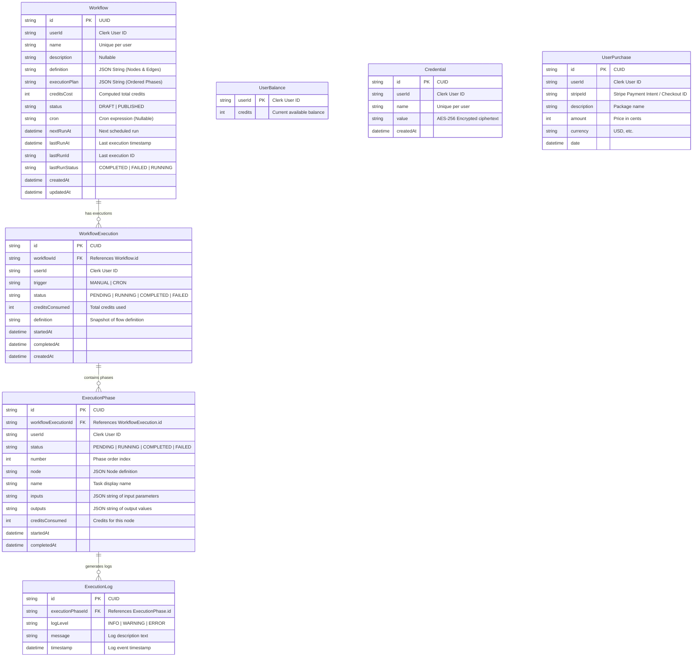
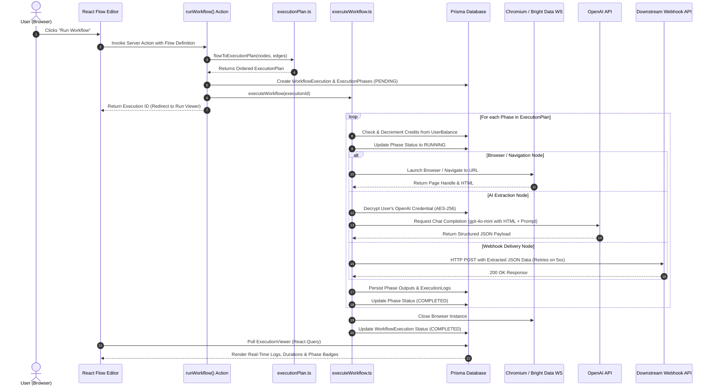
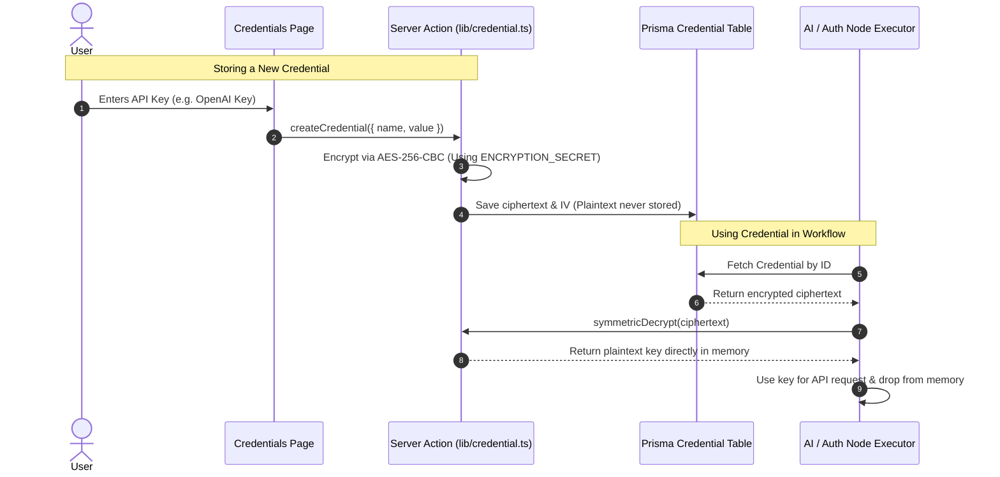

# 📐 ScrapeFlow — Complete Mermaid Architecture & System Diagrams

This document provides complete, visual Mermaid diagrams detailing every layer of ScrapeFlow: high-level architecture, execution lifecycle, database schema (ERD), sequence diagrams, and security workflows.

---

## 1. 🌐 High-Level System Architecture

---

## 2. 🔄 Workflow Execution Lifecycle (Flowchart)

---

## 3. 📊 Database Entity Relationship Diagram (ERD)

---

## 4. ⏱️ Sequence Diagram: Workflow Execution & Telemetry

---

## 5. 🔐 Security & Encrypted Credential Vault

