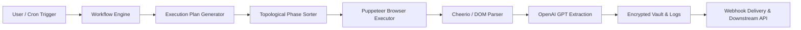

# 📄 ScrapeFlow — Comprehensive Project & Submission Report

---

## 📌 Executive Summary

**Project Name**: ScrapeFlow  
**Repository**: [https://github.com/Vamshavardhan50/ScrapeFlow](https://github.com/Vamshavardhan50/ScrapeFlow)  
**Primary Tech Stack**: Next.js 14 (App Router, Server Actions), React Flow, Puppeteer, Prisma ORM, SQLite / PostgreSQL, Clerk Auth, Stripe, Tailwind CSS, shadcn/ui.

**ScrapeFlow** is an enterprise-grade visual workflow platform designed to automate web scraping, dynamic browser interactions, and AI-driven data extraction without writing fragile, low-level scripts. By marrying an intuitive node graph with a powerful headless browser engine and LLM semantic parsing, ScrapeFlow turns complex web data extraction into a reliable, no-code drag-and-drop process.

---

## 🎯 Problem Statement

1. **High Fragility of Web Scrapers**: Modern web applications frequently change DOM layouts, class hashes, and frontend frameworks. Traditional rule-based scrapers (using hardcoded CSS/XPath selectors) break continuously, leading to high maintenance costs.
2. **Dynamic Content & Anti-Bot Obstacles**: Most valuable target websites rely on client-side rendering (React/Vue), infinite scrolling, JavaScript triggers, and bot mitigation services that fail simple HTTP GET requests.
3. **High Infrastructure Overhead**: Managing headless browser instances, proxy rotation, cron schedulers, encrypted secret vaults, and webhook dispatching requires complex DevOps and boilerplate architecture.
4. **Data Normalization Headaches**: Converting unstructured, dirty HTML tables into clean, typed JSON requires cumbersome regex expressions and manual mapping scripts.

---

## 💡 The Solution: ScrapeFlow

ScrapeFlow solves these problems through an integrated, user-friendly ecosystem:
- **Visual Canvas**: Drag-and-drop nodes to configure browsing, user interactions (clicking, scrolling, typing), extraction, and delivery.
- **Resilient AI Extraction**: Feeds raw page HTML to OpenAI GPT-4 with natural language prompts to return structured, validated JSON data automatically.
- **Managed Execution & Telemetry**: Detailed per-phase logs, duration metrics, credit metering, and automatic webhook dispatches upon workflow completion.
- **Enterprise Security**: Master-key AES-256 encrypted credential management for third-party tokens and passwords.

---

## 🏗️ System Architecture & Workflow Lifecycle

### Execution Lifecycle:
1. **Plan Generation (`executionPlan.ts`)**: When a workflow runs, the graph is analyzed for cyclic dependencies and sorted topologically into sequential execution phases.
2. **Context Creation (`executeWorkflow.ts`)**: An execution context initializes browser instances, environment variables, and decrypted credentials.
3. **Phase Execution (`executor/Registry.ts`)**: Each node executes with isolated input/output bindings. Telemetry and real-time logs are committed to the database.
4. **Completion & Webhook Delivery**: Results are formatted into structured JSON and pushed to external endpoints with retry handling.

---

## 🛠️ Bright Data & Scraper Studio Integration

- **Remote Browser Connectivity**: Integrated via WebSocket endpoint (`BROWSER_WS_ENDPOINT`) to offload heavy Chromium execution to Bright Data / Scraper Studio infrastructure.
- **Anti-Bot & Proxy Handling**: Leverages proxy rotation and fingerprint emulation to ensure uninterrupted scraping on bot-protected e-commerce and media targets.
- **Prone-to-Failure Tasks Delegated**: Uses remote rendering to eliminate local server resource limits when scaling simultaneous scraping jobs.

---

## 📊 Key Modules & Deliverables

| Module | Purpose | Status |
| :--- | :--- | :--- |
| **Workflow Canvas** | React Flow drag-and-drop editor with customizable nodes & validation | ✅ Completed |
| **Puppeteer Executor** | Headless browser engine with click, scroll, fill, and navigate actions | ✅ Completed |
| **AI Extraction** | OpenAI GPT structured JSON extraction from raw HTML | ✅ Completed |
| **Cron Scheduling** | Background task triggers with UTC & local timezone calculation | ✅ Completed |
| **Credential Manager** | AES-256 encrypted token vault | ✅ Completed |
| **Billing & Credits** | Stripe checkout, balance ledger, and invoice generator | ✅ Completed |
| **Phase Telemetry** | Granular execution logs with timing and duration metrics | ✅ Completed |

---

## 🔮 Future Roadmap

- [ ] **Multi-Agent Scraping Swarms**: Concurrent parallel node branches executing simultaneously across distributed browser workers.
- [ ] **Visual Selector Inspector**: Point-and-click element selector overlay embedded directly in the workflow canvas.
- [ ] **Export to Python / Node.js**: Export visual workflows directly as standalone Puppeteer / Playwright scripts.
- [ ] **Pre-built Marketplace Templates**: Ready-to-run workflows for Amazon, LinkedIn, Google Maps, and Twitter.
